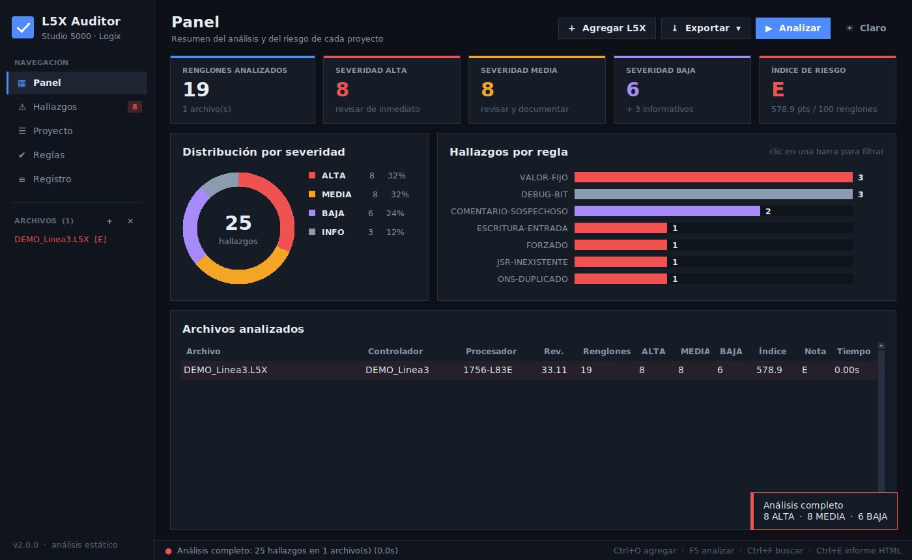
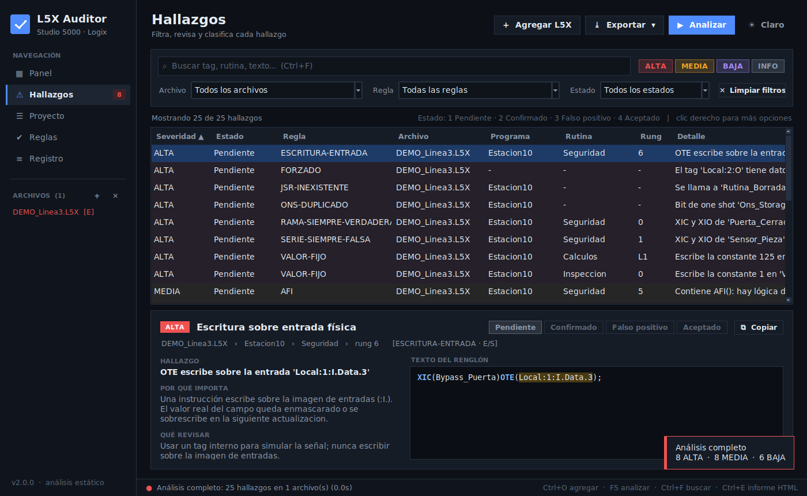

# L5X Auditor

Herramienta de **análisis estático** para proyectos de Rockwell **Studio 5000 / Logix Designer**
exportados a `.L5X`. Detecta patrones que suelen indicar lógica puenteada, deshabilitada,
forzada o mal escrita, y genera informes listos para compartir.

> Cada hallazgo debe confirmarse en el contexto de la máquina. La herramienta no sustituye
> una revisión manual.





## Características

- **Interfaz moderna** con tema oscuro y claro, panel con indicadores, gráficos y un índice de riesgo por proyecto.
- **Tabla de hallazgos** con búsqueda, filtros por severidad, archivo, regla y estado, ordenamiento por columna
  y un panel de detalle con el texto del renglón resaltado, *por qué importa* y *qué revisar*.
- **Flujo de revisión**: marca cada hallazgo como *Confirmado*, *Falso positivo* o *Aceptado* (teclas 1 a 4).
  Los estados se guardan automáticamente y se incluyen en los informes.
- **Vista de proyecto**: datos del controlador, programas, tareas y las instrucciones que más se usan.
- **Reglas configurables**: puedes activar o desactivar cada regla, y la selección se recuerda.
- **Informes** en HTML (interactivo, se puede imprimir), Excel, CSV y JSON.
- **Modo consola** para automatizar la revisión (por ejemplo en CI), con un código de salida según la severidad.
- **Proyecto demo** incluido para probar la herramienta sin tener un L5X a mano.
- Usa solo la biblioteca estándar de Python.

## Reglas

| Severidad | Código | Qué detecta |
|---|---|---|
| ALTA | `RAMA-SIEMPRE-VERDADERA` | XIC y XIO del mismo tag en ramas paralelas (interlock anulado) |
| ALTA | `SERIE-SIEMPRE-FALSA` | XIC y XIO del mismo tag en serie (el renglón nunca conduce) |
| ALTA | `VALOR-FIJO` | Constante escrita en resultados de inspección/medición (RLL y ST) |
| ALTA | `ONS-DUPLICADO` | Bit de almacenamiento de ONS/OSR/OSF reutilizado |
| ALTA | `ESCRITURA-ENTRADA` | Escritura sobre la imagen de entradas físicas (`:I.`) |
| ALTA | `JSR-INEXISTENTE` | JSR/FOR a una rutina que no existe |
| ALTA | `FORZADO` | Tags con datos de forzado activos en el export |
| MEDIA | `AFI` | Lógica deshabilitada con `AFI()` |
| MEDIA | `TIMER-PRE-0` | Preset de temporizador cargado con 0 |
| MEDIA | `OTE-DUPLICADA` | Doble bobina: la misma OTE en varios renglones |
| MEDIA | `OTL-SIN-OTU` | Enclavamiento sin desenclavamiento en el mismo programa |
| MEDIA | `TIMER-DUPLICADO` | El mismo temporizador en varias instrucciones |
| MEDIA | `TAREA-INHIBIDA` | Tarea marcada como inhibida |
| MEDIA | `PROGRAMA-DESHABILITADO` | Programa deshabilitado |
| MEDIA | `ST-CONDICION-CONSTANTE` | `IF 1 THEN`, `WHILE TRUE DO`… en texto estructurado |
| BAJA | `JMP` | Saltos JMP/LBL |
| BAJA | `COMENTARIO-SOSPECHOSO` | Comentarios que mencionan bypass, puente, prueba, temporal… |
| BAJA | `RUTINA-SIN-LLAMAR` | Rutinas que ningún JSR llama |
| BAJA | `PROGRAMA-SIN-TAREA` | Programas no asignados a ninguna tarea |
| INFO | `DEBUG-BIT` | Bits de debug/bypass que condicionan lógica, con su valor actual |

## Requisitos

- Python 3.8 o superior, con Tkinter (viene incluido en el instalador oficial de Windows).
- Opcional: `pip install -r requirements-optional.txt`
  - `openpyxl` para exportar a Excel.
  - `tkinterdnd2` para arrastrar y soltar archivos sobre la ventana.

## Uso

### Interfaz gráfica

```bash
python l5x_auditor_gui.py
```

1. En Studio 5000: **File > Save As > Logix Designer XML File (\*.L5X)**.
2. Agrega uno o varios `.L5X` (**+ Agregar L5X** o `Ctrl+O`) y pulsa **Analizar** (`F5`).
3. Revisa el **Panel**. Haz clic en un indicador o en una barra para filtrar los hallazgos.
4. En **Hallazgos**, clasifica cada uno y exporta el informe (`Ctrl+E` genera el HTML).

| Atajo | Acción |
|---|---|
| `Ctrl+O` | Agregar archivos |
| `F5` | Analizar |
| `Ctrl+F` | Buscar en los hallazgos |
| `Ctrl+E` | Informe HTML |
| `1` a `4` | Pendiente / Confirmado / Falso positivo / Aceptado |
| `Ctrl+C` | Copiar el hallazgo seleccionado |
| Clic derecho | Menú contextual (filtrar o desactivar la regla) |

### Consola

```bash
python l5x_auditor_gui.py proyecto.L5X                         # resumen en pantalla
python l5x_auditor_gui.py *.L5X --html informe.html --csv r.csv
python l5x_auditor_gui.py proyecto.L5X --min-sev MEDIA --xlsx r.xlsx
python l5x_auditor_gui.py proyecto.L5X --disable JMP --disable AFI
python l5x_auditor_gui.py proyecto.L5X --fail-on ALTA          # sale con código 2 si hay hallazgos ALTA
python l5x_auditor_gui.py --list-rules
python l5x_auditor_gui.py --demo --html demo.html
```

## Índice de riesgo

Cada hallazgo suma puntos según su severidad (ALTA = 10, MEDIA = 3, BAJA = 1). El total se normaliza
por cada 100 renglones o líneas de ST y se traduce a una nota: **A** (< 2), **B** (< 8), **C** (< 20),
**D** (< 45) o **E**. Es un indicador orientativo que sirve para comparar proyectos y priorizar la revisión.

## Ejecutable para Windows

```bat
build_exe.bat
```

Genera `dist\L5X_Auditor.exe` con PyInstaller. No hace falta tener Python en el equipo destino.

## Pruebas

```bash
python -m unittest discover -s tests -v
```

## Datos locales

La configuración (tema, reglas activas, carpetas recientes) y los estados de revisión se guardan en
`%APPDATA%\L5XAuditor` en Windows, o en `~/.config/L5XAuditor` en Linux y macOS. Nunca se modifica el archivo L5X.
